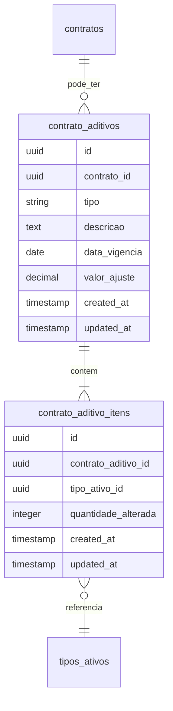

# Proposta: Contrato Aditivos

> **Status:** Backlog (despriorizado)
> **Data de criação:** 2025-02-11
> **Prioridade:** Baixa
> **Dependência:** Contratos (Sprint 2)

## Contexto

Durante a análise de Contratos, identificamos a necessidade de aditivos para alterações após o contrato estar ativo. A funcionalidade foi despriorizada para ser revisitada posteriormente.

## Tipos de Aditivos

| Tipo | Descrição |
|------|-----------|
| prorrogacao | Extensão do prazo do contrato |
| acrescimo | Adição de novos itens |
| reducao | Remoção de itens existentes |
| alteracao_valor | Mudança no valor sem alterar itens |

## Estrutura Proposta

### Tabelas

### Campos

**contrato_aditivos:**
- `tipo`: prorrogacao, acrescimo, reducao, alteracao_valor
- `valor_ajuste`: valor positivo ou negativo do ajuste financeiro
- `data_vigencia`: quando o aditivo entra em vigor

**contrato_aditivo_itens:**
- `quantidade_alterada`: positivo para acréscimo, negativo para redução

## Cenário de Exemplo

**Contrato original:** 15 Placas EVA alocadas (12 Lote A + 3 Lote B)

**Aditivo de redução para 8:** quantidade_alterada = -7

### Pergunta em Aberto

**Critério para liberar itens na redução:**

| Opção | Descrição | Prós | Contras |
|-------|-----------|------|---------|
| LIFO | Último alocado primeiro | Simples, automático | Pode não fazer sentido logístico |
| Proporcional | Libera de cada lote | Distribuído | Pode gerar frações |
| Manual | Usuário escolhe | Controle total | Mais complexo na UI |

**Decisão pendente para quando revisitarmos.**

## Impacto nas Outras Tabelas

Ao implementar aditivos:
1. `alocacoes_lotes` precisa ser atualizada para refletir liberações
2. `lotes.quantidade_disponivel` precisa ser recalculada
3. `contratos.valor_total` pode precisar de campo adicional para valor atual vs original

## Referências

- Funcionalidade Contratos: `docs/analises/features/contratos.md`
- Modelo de Dados: `docs/analises/modelo-dados.md`
- Milestone: `docs/MILESTONES.md` (M2 - Contratos Completo)
- Sprint 2: `docs/sprints/sprint-02.md`
