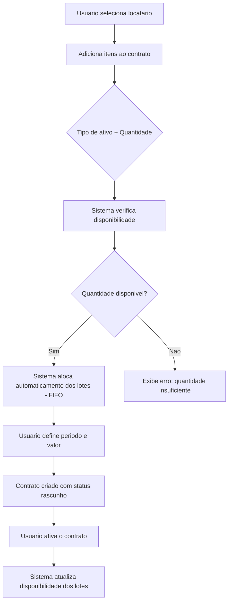
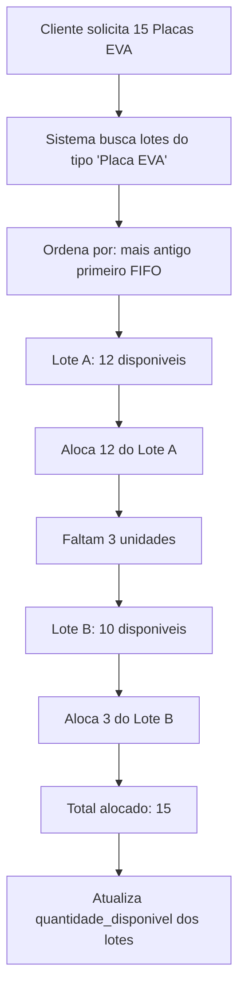

# Funcionalidade: Contratos

> **Status:** Planejado
> **Milestone:** M1 - MVP Contratos
> **Sprint:** 02 (a criar)
> **Ultima atualizacao:** 2025-02-11

---

## Descricao

Sistema de gestao de contratos de locacao de ativos entre o tenant (locador) e seus clientes (locatarios).

---

## Modelo de Dados

Ver: `docs/analises/modelo-dados.md`

---

## Regras de Negocio

### RN01 - Alocacao Automatica (FIFO)
O sistema aloca automaticamente os itens do contrato a partir dos lotes disponiveis, usando o criterio **FIFO** (First In, First Out - lote mais antigo primeiro).

**Exemplo:**
- Locatario solicita 15 Placas de EVA
- Lote A (mais antigo): 12 disponiveis
- Lote B: 10 disponiveis
- Sistema aloca: 12 do Lote A + 3 do Lote B

### RN02 - Contrato Ativo e Imutavel
Apos ativado, o contrato **nao pode ser editado diretamente**. Alteracoes requerem aditivo (funcionalidade futura - ver M2).

### RN03 - Revogacao Libera Itens
Ao revogar/cancelar um contrato, os itens alocados sao automaticamente liberados e retornam aos lotes de origem.

### RN04 - Validacao de Disponibilidade
O sistema valida se ha quantidade suficiente de ativos disponiveis antes de permitir a criacao do contrato.

### RN05 - Isolamento Multi-tenant
Cada tenant visualiza apenas seus proprios contratos, locatarios e lotes.

---

## Status do Contrato

| Status | Descricao |
|--------|-----------|
| rascunho | Contrato em criacao, pode ser editado |
| ativo | Contrato vigente, itens alocados |
| finalizado | Contrato encerrado normalmente |
| cancelado | Contrato revogado antes do termino |

---

## Fluxo de Criacao de Contrato

---

## Fluxo de Alocacao Automatica

---

## Decisoes Tomadas

| Pergunta | Decisao |
|----------|---------|
| Criterio de alocacao | **FIFO** (lote mais antigo primeiro) |
| Edicao de contrato ativo | **Apenas via aditivo** (M2) |
| Revogacao libera itens | **Sim**, automaticamente |
| Arquitetura | **Multi-tenant (SaaS)** |

---

## Alertas de Vencimento

Alertas serao enviados nos seguintes momentos antes do vencimento:
- 60 dias
- 30 dias
- 15 dias
- 5 dias

**Implementacao:** Via job/scheduler (sem tabela dedicada).

---

## Funcionalidades Relacionadas

### Dependencias
- Cadastro de Locatarios
- Cadastro de Tipos de Ativos
- Gestao de Lotes

### Funcionalidades Futuras
- Aditivos de Contrato (M2): `docs/analises/features/contrato-aditivos-proposta.md`

---

## Referencias

- Modelo de Dados: `docs/analises/modelo-dados.md`
- Milestone: `docs/MILESTONES.md`
- Proposta Aditivos: `docs/analises/features/contrato-aditivos-proposta.md`
