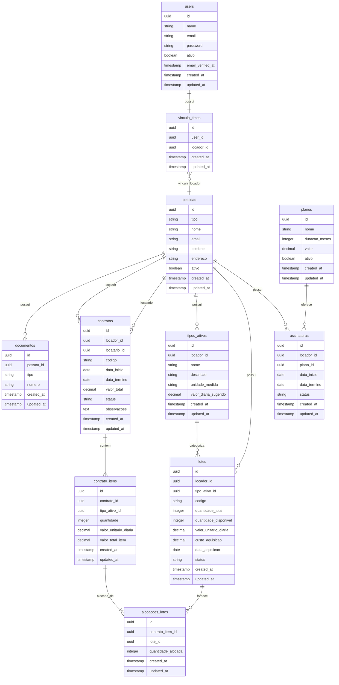
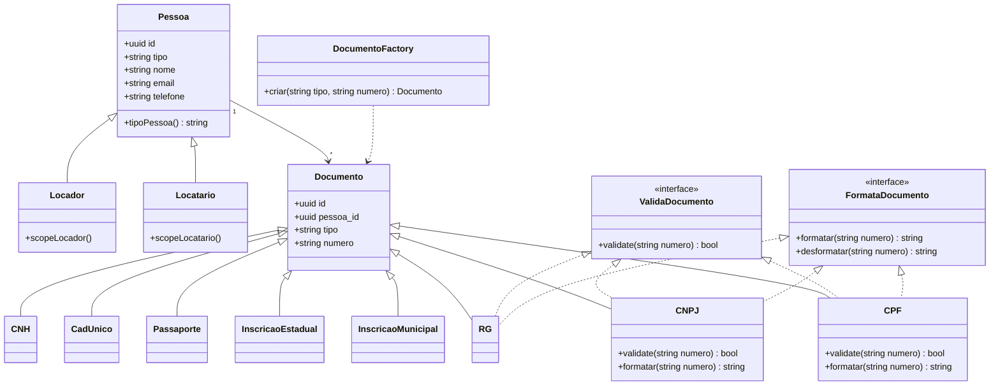
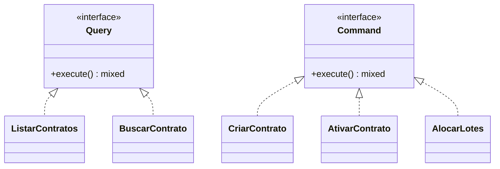

# Modelo de Dados - Grapo

> **Versao:** 1.1.0 (M1 - MVP Contratos)
> **Ultima atualizacao:** 2025-02-11
> **Milestone:** M1

---

## Diagrama ER

---

## Diagrama de Classes - Pessoa e Documento

---

## Descricao das Entidades

### users
Quem acessa o sistema (credenciais de login).

### vinculo_times
Vincula um User a um Locador. Um User so pode estar vinculado a um Locador.

### pessoas
Entidade unificada para Locador e Locatario. O campo `tipo` define o papel:
- **locador**: Quem aluga equipamentos (empresa de locacao)
- **locatario**: Quem aluga equipamentos do locador (cliente)
- **responsavel_fin**: Responsavel financeiro
- **responsavel_adm**: Responsavel administrativo

**Accessor `tipo_pessoa`**: Retorna PF ou PJ baseado nos documentos:
- **PJ**: CNPJ, Inscricao Municipal, Inscricao Estadual
- **PF**: CPF, RG, CadUnico, Passaporte, CNH

### documentos
Documentos de uma pessoa. Cada tipo tem classe propria com validacao e formatacao.

Tipos suportados:
- cpf
- cnpj
- rg
- cnh
- passaporte
- inscricao_municipal
- inscricao_estadual
- cadunico

### planos
Planos de assinatura da Grapo:
- Trimestral: R$ 75,00
- Semestral: R$ 140,00
- Anual: R$ 250,00

### assinaturas
Vinculo entre locador e plano. Controla o periodo de acesso a plataforma.

### tipos_ativos
Categorizacao dos equipamentos disponiveis para locacao. Ex: "Placa de EVA", "Betoneira 400L".

Isolado por `locador_id`.

### lotes
Agrupamento fisico de ativos do mesmo tipo. O locador cadastra lotes e o sistema controla a disponibilidade.

Isolado por `locador_id`.

### contratos
Acordo formal entre locador e locatario. Contem periodo, valor e status.

**Regra:** Apos ativo, so pode ser alterado via aditivo (funcionalidade futura - ver M2).

### contrato_itens
Itens solicitados pelo locatario no contrato.

### alocacoes_lotes
Tabela interna de mapeamento automatico usando **FIFO** (lote mais antigo primeiro).

**Esta informacao nao e exibida ao usuario.**

---

## Isolamento de Dados

O isolamento e feito por `locador_id`:

1. User faz login
2. Sistema identifica o Locador via `vinculo_times`
3. Todas as queries filtram por `locador_id`

Entidades isoladas:
- tipos_ativos
- lotes
- contratos
- assinaturas

Entidades globais:
- planos
- users

---

## Interfaces CQRS

Todas as Actions implementam `Query` (leitura) ou `Command` (escrita).

---

## Historico de Versoes

| Versao | Milestone | Alteracoes |
|--------|-----------|------------|
| 1.0.0 | M1 | Modelo inicial com tenants/locatarios separados |
| 1.1.0 | M1 | Unificacao em pessoas, documentos, vinculo_times, CQRS |

---

## Proximas Alteracoes Planejadas

### M2 - Contratos Completo
Novas entidades:
- `contrato_aditivos`
- `contrato_aditivo_itens`

Ver proposta: `docs/analises/features/contrato-aditivos-proposta.md`

---

## Referencias

- Funcionalidade Contratos: `docs/analises/features/contratos.md`
- Proposta Aditivos: `docs/analises/features/contrato-aditivos-proposta.md`
- Milestone atual: `docs/MILESTONES.md`
- Versao anterior: `docs/analises/arquivo/modelo-dados.m1-v1.md`
